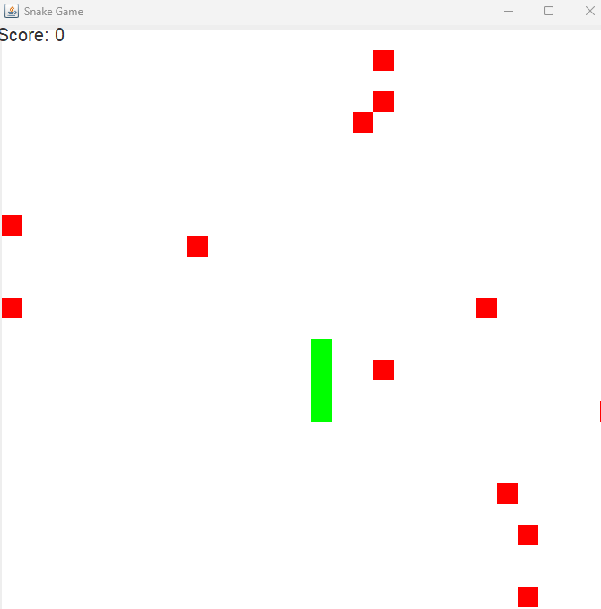

# Snake Game

#### The game "Snake" created in Java using the Swing and Graphics libraries.

By Braden Zingler

## Overview

There is actually a good amount of logic that goes into the seemingly simple game. I decided to make this project to learn more about Java GUI and it's advantages and do a general review of basic Java syntax and data structures because it has been a while since I have used them. The snake is a LinkedList of Cells, where a Cell is a Java object which extends JPanel. Each cell corresponds to a single square in the JPanel, which is using a GridLayout. So, the game board is made up of a grid or 2D array of cells which can be used to update the location of the snake and generate fruit.

## Food Generation

To generate the food in random places, when the Snake "eats" a piece of food I iterate over each cell in the grid. If that cell is empty AND rand.nextInt(600) == 3 returns true, then a piece of food will be generated at this cell. 600 was just an arbitrary value I chose which I felt made the game feel fair. If I were to go more in depth I think I would also check that the four surrounding cells are not a piece of food, there aren't more than X food cells already on the board, the food cells are evenly distributed, etc. I also thought about adding power-up cells which could allow the snake to travel through walls for a certain amount of time or slow down.

## Movement Logic

To move the snake forward, I first calculate the next cell based on the users input direction. Then, I check if the snake is going to hit a wall, food, or itself and respond accordingly. After all this, I update the tail by removing the last element of the LinkedList of cells, updating the corresponding 2D board array to be an empty cell, and then updating the current position of the snake.

Then, I update the head of the snake by setting the current position to empty, pushing a new Cell of type Snake to the LinkedList, and updating the board appropriately.

Then, I redraw the board with the new board positions by completely clearing the board, iterating over each element, and setting each element appropriately. While this initially sounded resource intensive, I learned that this is actually standard practice and I should reset my board each time it updates.

## Game Engine

I created a "clock" for the game to continuously update by simply creating a while loop with a Thread.sleep() of 170ms. This can be updated to speed up the game which I do when the snake eats a piece of food. The clock is also conditional, which allows me to turn it off when the snake dies and prevent exceptions from occuring.
